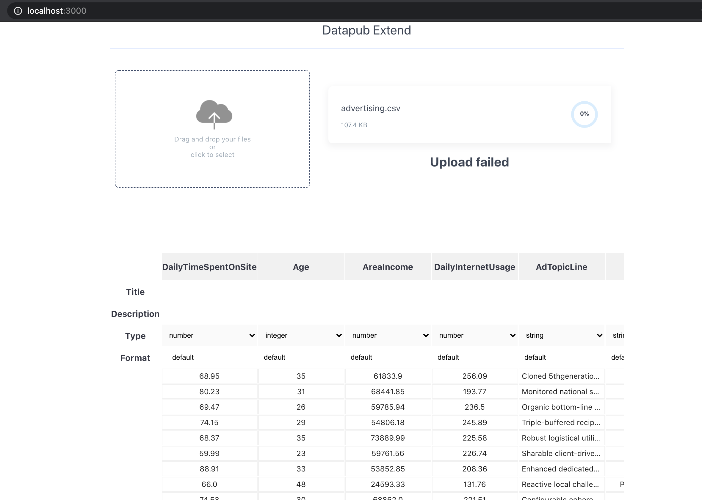
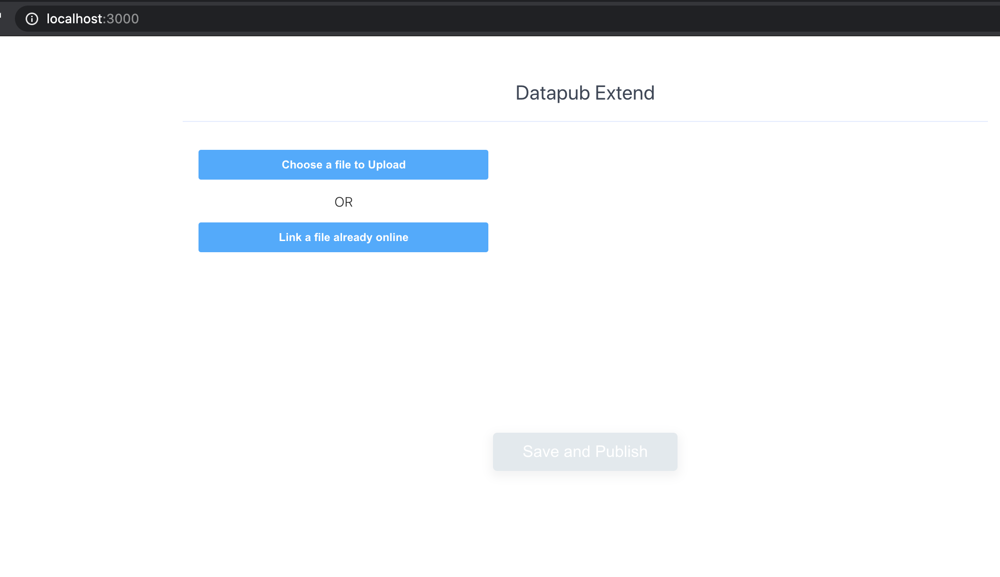

## Using TableSchema Component In your React App

In this example, you'll extend this [basic example](../reusable_datapub_basic) to include a TableSchema component. By the end of this example, you'll have a working application like the one below:



### Pre-requisite

- Have Node and Npm/Yarn installed
- Have create-react-app installed

### Set-up
In a new folder of your work space, open a terminal and create a new react application:
```bash
    create-react-app datapub-extend
```
Change directory into datapub-extend and run the application to ensure it was created successfully:
```bash
    cd datapub-extend
    yarn start
```
If you can see the react logo in your browser, then everything works fine. In the next section, you'll install Datapub and import some components for use. 

Open `datapub-extend` in your code editor, and add the following to your dependencies in `package.json`:

```json
    ...
        "datapub": "git+https://github.com/datopian/datapub.git",
        "ckanClient": "git+https://github.com/datopian/ckan-client-js.git",

    ...
```

Run `yarn` or `npm install` in your terminal to install Datapub. This installs the latest version of datapub and ckanClient from Github. 

In your App.js script in `src` folder, delete the auto generated contents and add the import statements below:

```javascript
import React from 'react';
import { Client } from "ckanClient";
import PropTypes from "prop-types";
import frictionlessCkanMapper from "frictionless-ckan-mapper-js";
import { Upload, TableSchema } from "datapub";
import './App.css';
```
You're are creating a client for accessing CKAN using the ckanClient package, importing the frictionless-ckan-mapper for mapping schema, and most importantly importing two components (upload and TableSchema) from datapub. 

The TableSchema component displays a react-table with 20 rows of sample data from any uploaded CSV file. Properties displayed by the TableSchema includes:

- Column names
- Title: Editable field that can be used to change the names of columns before saving. 
- Description: Editable field that can be used to describe each column.
- Inferred Column types
- Format

Next, you'll add the `ResourceEditor`. Copy and paste the code below just in your App.js script:

```javascript

export class ResourceEditor extends React.Component {
  constructor(props) {
    super(props);
    this.state = {
      datasetId: this.props.config.datasetId,
      resourceId: "",
      resource: this.props.resource || {},
      ui: {
        fileOrLink: "",
        uploadComplete: undefined,
        success: false,
        error: false,
        loading: false,
      },
      client: null,
      isResourceEdit: false,
    };
    this.metadataHandler = this.metadataHandler.bind(this);
  }

  async componentDidMount() {
    const { config } = this.props;
    const {
      authToken,
      api,
      lfs,
      organizationId,
      datasetId,
      resourceId,
    } = config;

    const client = new Client(
      `${authToken}`,
      `${organizationId}`,
      `${datasetId}`,
      `${api}`,
      `${lfs}`
    );

    //Check if the user is editing resource
    if (resourceId) {
      const resource = await client.action("resource_show", { id: resourceId });
      const resourceSchema = await client.action("resource_schema_show", {
        id: resourceId,
      });
      const resourceSample = await client.action("resource_sample_show", {
        id: resourceId,
      });

      let resourceCopy = resource.result;
      let sampleCopy = [];

      try {
        // push the values to an array
        for (const property in resourceSample.result) {
          sampleCopy.push(resourceSample.result[property]);
        }
        // push sample as an array to be able to render in tableschema component
        resourceCopy.sample = sampleCopy;
        resourceCopy.schema = resourceSchema.result;
      } catch (e) {
        console.error(e);
        //generate empty values not to break the tableschema component
        resourceCopy.schema = { fields: [] };
        resourceCopy.sample = [];
      }

      return this.setState({
        client,
        resourceId,
        resource: resourceCopy,
        isResourceEdit: true,
      });
    }

    this.setState({ client });
  }

  metadataHandler(resource) {
    this.setState({
      resource,
    });
  }

  handleChangeMetadata = (event) => {
    const target = event.target;
    const value = target.value;
    const name = target.name;
    let resourceCopy = this.state.resource;
    resourceCopy[name] = value;

    this.setState({
      resource: resourceCopy,
    });
  };

  handleSubmitMetadata = async () => {
    const { resource, client } = this.state;

    await this.createResource(resource);
    const isResourceCreate = true;
    if (isResourceCreate) {
      const datasetMetadata = await client.action("package_show", {
        id: this.state.datasetId,
      });
      let result = datasetMetadata.result;

      if (result.state === "draft") {
        result.state = "active";
        await client.action("package_update", result);
      }
    }

    // Redirect to dataset page
    return (window.location.href = `/dataset/${this.state.datasetId}`);
  };

  createResource = async (resource) => {
    const { client } = this.state;
    const { config } = this.props;
    const { organizationId, datasetId, resourceId } = config;

    const ckanResource = frictionlessCkanMapper.resourceFrictionlessToCkan(
      resource
    );

    //create a valid format from sample
    let data = { ...ckanResource.sample };
    //delete sample because is an invalid format
    delete ckanResource.sample;

    // create a copy from ckanResource to add package_id, name, url, sha256,size, lfs_prefix, url, url_type
    // without this properties ckan-blob-storage doesn't work properly
    let ckanResourceCopy = {
      ...ckanResource,
      package_id: this.state.datasetId,
      name: resource.name || resource.title,
      sha256: resource.hash,
      size: resource.size,
      lfs_prefix: `${organizationId}/${datasetId}`,
      url: resource.name,
      url_type: "upload",
      sample: data,
    };

    //Check if the user is editing resource, call resource_update and redirect to the dataset page
    if (resourceId) {
      ckanResourceCopy = {
        ...ckanResourceCopy,
        id: resourceId,
      };
      await client.action("resource_update", ckanResourceCopy);

      return (window.location.href = `/dataset/${datasetId}`);
    }
    await client
      .action("resource_create", ckanResourceCopy)
      .then((response) => {
        this.onChangeResourceId(response.result.id);
      });
  };

  deleteResource = async () => {
    const { resource, client, datasetId } = this.state;
    if (window.confirm("Are you sure to delete this resource?")) {
      await client.action("resource_delete", { id: resource.id });

      return (window.location.href = `/dataset/${datasetId}`);
    }
  };

  handleUploadStatus = (status) => {
    const { ui } = this.state;
    const newUiState = {
      ...ui,
      success: status.success,
      error: status.error,
      loading: status.loading,
    };

    this.setState({ ui: newUiState });
  };

  onChangeResourceId = (resourceId) => {
    this.setState({ resourceId });
  };
}
```

Next, you'll the Datapub components (Upload and TableSchema). At the end of `ResourceEditor` class, add the react render method, and initialize the Datapub components you have imported as shown below:

```javascript

    ...
    ...

    render() {
    const { success } = this.state.ui;

    return (
      <div className="App">
        <form
          className="upload-wrapper"
          onSubmit={(event) => {
            event.preventDefault();
            if (this.state.isResourceEdit) {
              return this.createResource(this.state.resource);
            }
            return this.handleSubmitMetadata();
          }}
        >
          <div className="upload-header">
            <h2 className="upload-header__title">Datapub GDX</h2>
          </div>

          <Upload
            client={this.state.client}
            resource={this.state.resource}
            metadataHandler={this.metadataHandler}
            datasetId={this.state.datasetId}
            handleUploadStatus={this.handleUploadStatus}
            onChangeResourceId={this.onChangeResourceId}
          />

          <div className="upload-edit-area">

            {this.state.resource.schema && (
              <TableSchema
                schema={this.state.resource.schema}
                data={this.state.resource.sample || []}
              />
            )}

            {!this.state.isResourceEdit ? (
              <button disabled={!success} className="btn">
                Save and Publish
              </button>
            ) : (
              <div className="resource-edit-actions">
                <button
                  type="button"
                  className="btn btn-delete"
                  onClick={this.deleteResource}
                >
                  Delete
                </button>
                <button className="btn">Update</button>
              </div>
            )}
          </div>
        </form>
      </div>
    );
  }
```

The TableSchema component requires two properties
- schema (data schema)
- data (sample data)

The Upload component requires 5 properties:
- client
- resource
- metadataHandler
- datasetId
- handleUploadStatus
- onChangeResourceId


Finally, add this last bit of code to define your default configuration for the ResourceEditor before exporting the component. 

```javascript

ResourceEditor.defaultProps = {
  config: {
    authToken: "be270cae-1c77-4853-b8c1-30b6cf5e9878",
    api: "http://127.0.0.1:5000",
    lfs: "http://localhost:9419", 
    organizationId: "myorg",
    datasetId: "sample_1",
  },
};

ResourceEditor.propTypes = {
  config: PropTypes.object.isRequired,
};

export default ResourceEditor;
```

You can see the full App.js script [here](./src/App.js)

Next, open your `index.js` script, delete the existing code and paste the one below:

```javascript
import React from 'react';
import ReactDOM from 'react-dom';
import App from './App';


const element = document.getElementById('ResourceEditor');
if (element) {
  const config = {
    datasetId: element.getAttribute('data-dataset-id'),
    api: element.getAttribute('data-api'),
    lfs: element.getAttribute('data-lfs'),
    authToken: element.getAttribute('data-auth-token'),
    organizationId: element.getAttribute('data-organization-id'),
    resourceId: element.getAttribute('data-resource-id')
  }

  ReactDOM.render(
    <React.StrictMode>
        <App
          config={config}
          resource={ element.getAttribute('data-resource')}
        />
    </React.StrictMode>,
    element
  );
}


export { ResourceEditor } from './App';
```

This automatically mounts the ResourceEditor component in the your homepage if an element with the ID `ResourceEditor` exists. 

The `ResourceEditor` element does not exist since you've not created one, so open your index.html file in the public folder, delete the:

```html
    <div id="root"></div>
```
and add:

```html
<div id="ResourceEditor"
     data-api="http://127.0.0.1:5000"
    data-lfs="http://localhost:9419" 
    data-auth-token="be270cae-1c77-4853-b8c1-30b6cf5e9228" 
    data-dataset-id="sample_1" 
    data-organization-id="myorg">
</div>
```

The properties `data-api`, `data-lfs`, `data-auth-token`, `data-dataset-id`, `data-organization-id` are for connecting to your Ckan instance using ckanClient. 

Now you're all set, you can start your application by running:
```bash
    yarn start
```

Your browser should open at port 3000 if its available.

You can customize styling, or add some pre-written ones. Copy the CSS style [here](./src/App.css) and add to your App.css. 

Your app should now display like:



Try uploading a CSV file, and the `TableSchema` will be displayed automatically. This proves that you have been able to successfully reuse the `Upload` and `TableSchema` components from `Datapub`. 


__Note:__ The upload only failed because you do not have a Ckan client running.

See the full code for this example project [here](./code/reusable_datapub_basic)

## See Also:
- [Adding Upload and Metadata Component to your react application](../reusable_datapub_basic/ReadMe.md)
